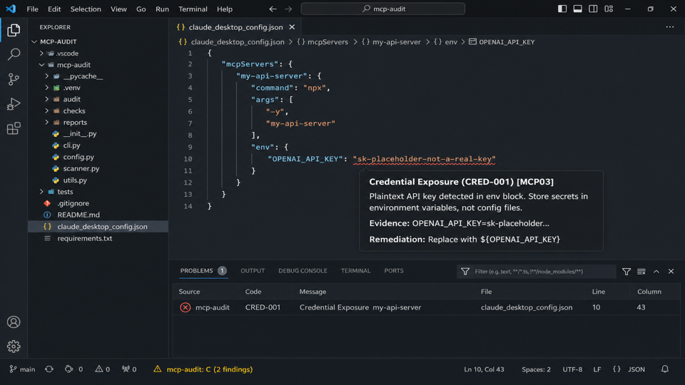

# mcp-audit — VS Code / Cursor Extension

[](https://marketplace.visualstudio.com/items?itemName=mcp-audit.mcp-audit-vscode)
[](https://marketplace.visualstudio.com/items?itemName=mcp-audit.mcp-audit-vscode)
[](https://marketplace.visualstudio.com/items?itemName=mcp-audit.mcp-audit-vscode)
[](LICENSE)

**Inline security diagnostics for [MCP](https://modelcontextprotocol.io/) server configuration files, powered by [mcp-audit](https://github.com/mcp-audit/mcp-audit).**

Red and yellow squiggles appear directly on vulnerable server keys in `claude_desktop_config.json`, `mcp.json`, and other MCP config files — the same findings `mcp-audit scan` reports, shown inline without leaving your editor.



---

## How to use

### Step 1 — Install the mcp-audit binary

The extension shells out to the `mcp-audit` binary. Install it first:

```bash
pip install mcp-audit
```

Or download a standalone binary for macOS, Linux, or Windows from the [Releases page](https://github.com/mcp-audit/mcp-audit/releases).

### Step 2 — Install this extension

Search for **mcp-audit** in the VS Code Extensions panel, or install from the terminal:

```bash
code --install-extension mcp-audit.mcp-audit-vscode
```

### Step 3 — Open an MCP config file

Open any supported config file. Diagnostics appear automatically within 3 seconds. No configuration required.

---

## What you get

| Feature | Detail |
|---|---|
| **Squiggles** | Red (CRITICAL/HIGH) or yellow (MEDIUM) underlines on offending server keys |
| **Hover cards** | Finding title, severity, description, evidence, remediation, OWASP MCP Top 10 tags |
| **Status bar** | `mcp-audit: B (3 findings)` — click to open the Problems panel |
| **Problems panel** | All findings listed with source `mcp-audit` and finding ID (e.g. `CRED-001`) |
| **Auto-scan** | Scans on open and on save (both configurable) |
| **Registry verdicts** | Inline badges and hover cards showing CVE counts, typosquat warnings, and registry status (requires mcp-audit ≥ 1.1.0) |

---

## Registry verdicts (mcp-audit ≥ 1.1.0)

When `mcp-audit vet` is available, each configured server key gets an inline badge showing its registry standing:

| Badge | Meaning |
|---|---|
| `✓ verified · 0 known CVEs (Anthropic)` | Package is in the registry, clean, with maintainer info |
| `⚠ 2 known CVEs — CVE-2024-1234, CVE-2024-5678` | Known vulnerabilities — Warning diagnostic added |
| `⚠ possible typosquat — did you mean filesystem?` | Package name looks like a typo — Warning diagnostic added |
| `? not in registry — no verdict available` | Package not found in registry — hint only, no squiggle |

> **TODO for Adam:** Replace the placeholder below with an actual demo GIF before the 0.2.0 Marketplace release.


Hovering over any server key shows the full verdict details: capabilities description, CVE list, and a link to the package's [mcp-audit.dev](https://mcp-audit.dev) page.

### How it works

The extension shells out to `mcp-audit vet <name> --format json` — no detection logic lives in TypeScript (ADR-0002). Results are cached per server name for the session; rapid saves are debounced (300 ms) to avoid redundant subprocess calls.

### Feature detection and graceful degradation

The first time an MCP config file is opened, the extension runs `mcp-audit vet --help`. If the subcommand is absent (binary older than 1.1.0) or fails, the verdict feature is silently disabled — scan diagnostics continue working normally.

### Verdict settings

| Setting | Default | Description |
|---|---|---|
| `mcp-audit.verdict.online` | `false` | Pass `--online` to `mcp-audit vet` for live registry lookups instead of the bundled snapshot |

---

## Supported config files

| File | MCP Client |
|---|---|
| `claude_desktop_config.json` | Claude Desktop |
| `mcp.json` | Cursor, generic MCP |
| `.cursor/mcp.json` | Cursor (project-level) |
| `.claude/settings.json` | Claude Code |
| `claude_code_config.json` | Claude Code (alternate) |
| `mcp_config.json` | Generic MCP |

---

## Command palette

Open the command palette (`Cmd/Ctrl+Shift+P`) and search for **mcp-audit**:

| Command | Action |
|---|---|
| `mcp-audit: Scan current file` | Manually re-scan the active file |
| `mcp-audit: Scan workspace` | Scan all currently open MCP config files |
| `mcp-audit: Fix current file` | Run `mcp-audit fix` and show the diff in the Output channel |

---

## Settings

| Setting | Default | Description |
|---|---|---|
| `mcp-audit.binaryPath` | `""` | Absolute path to the binary. Empty = auto-detect from PATH. |
| `mcp-audit.severityThreshold` | `"info"` | Minimum severity to report (`info`, `low`, `medium`, `high`, `critical`). |
| `mcp-audit.runOnSave` | `true` | Re-scan automatically on save. |
| `mcp-audit.runOnOpen` | `true` | Scan when a config file is opened. |
| `mcp-audit.verdict.online` | `false` | Pass `--online` to `mcp-audit vet` for live registry lookups (requires mcp-audit ≥ 1.1.0). |

---

## Severity mapping

| mcp-audit severity | VS Code diagnostic |
|---|---|
| CRITICAL | ❌ Error (red squiggle) |
| HIGH | ❌ Error (red squiggle) |
| MEDIUM | ⚠️ Warning (yellow squiggle) |
| LOW | ℹ️ Information (blue line) |
| INFO | 💡 Hint (grey dots) |

---

## Cursor compatibility

Cursor is a VS Code fork. This extension works in Cursor without modification. Install from the VS Code Marketplace or via `Extensions: Install from VSIX…` inside Cursor.

---

## Known limitations

- **Line precision:** Squiggles point to the server *key block*, not the exact offending line within it. The mcp-audit CLI does not yet emit per-finding line numbers — a follow-up will improve this once `Finding.line_number` is added to the model.
- **Large files:** Files over 5 MB are skipped (an INFO diagnostic is shown).
- **Scan timeout:** Scans cancelled after 10 seconds with a warning in the Output channel.

---

## How it works

The extension is a **thin wrapper** — it does not reimplement any detection logic:

1. Detects MCP config files by file name.
2. Spawns `mcp-audit scan --path <file> --format json`.
3. Parses the JSON `ScanResult` and converts `Finding[]` to `vscode.Diagnostic[]`.
4. Uses `jsonc-parser` to locate each finding's server key in the document.

All security detection runs in the `mcp-audit` binary (Python). The extension is TypeScript + VS Code API only.

---

## Troubleshooting

**"mcp-audit binary not found"**
Install `mcp-audit` with `pip install mcp-audit`, or set `mcp-audit.binaryPath` in your settings to the full path of the binary. Check `View → Output → mcp-audit` for details.

**No squiggles appear on open files**
Make sure `mcp-audit.runOnOpen` is `true`. Run `mcp-audit: Scan current file` from the command palette and check the Output channel for errors. Confirm the file name matches one of the supported names above.

**Squiggles are at line 1 instead of the right line**
This is a known limitation — see above. The finding is still reported correctly; only the underline position is approximate.

---

## Reporting issues

Please open an issue on the [mcp-audit-vscode issue tracker](https://github.com/mcp-audit/mcp-audit-vscode/issues).

For false positives or missed findings, please open an issue on the main [mcp-audit repo](https://github.com/mcp-audit/mcp-audit/issues) — those are detection bugs in the CLI, not the extension.

---

## Contributing

See [CONTRIBUTING.md](https://github.com/mcp-audit/mcp-audit/blob/main/docs/contributing-rules.md) in the main mcp-audit repo for information on contributing detection rules.

For extension bugs and PRs, see the [mcp-audit-vscode repository](https://github.com/mcp-audit/mcp-audit-vscode).

---

## License

Apache 2.0 — same as the main [mcp-audit](https://github.com/mcp-audit/mcp-audit) project.
